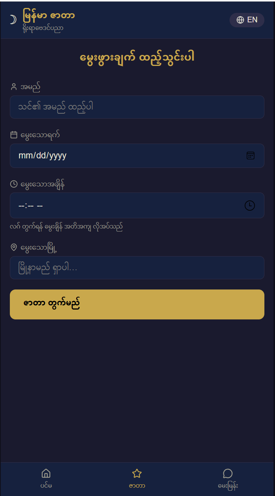
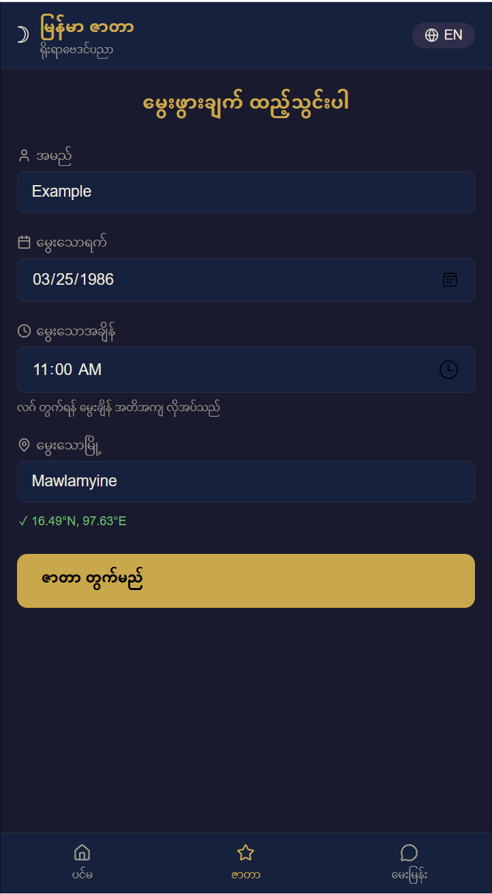
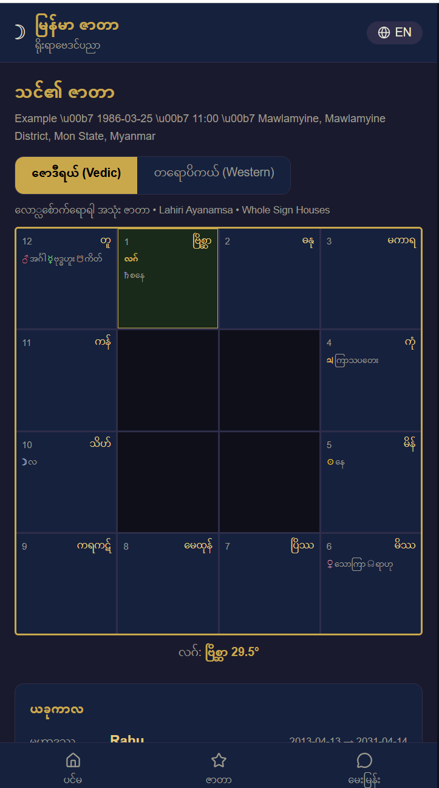
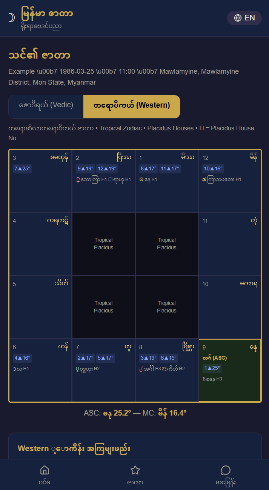
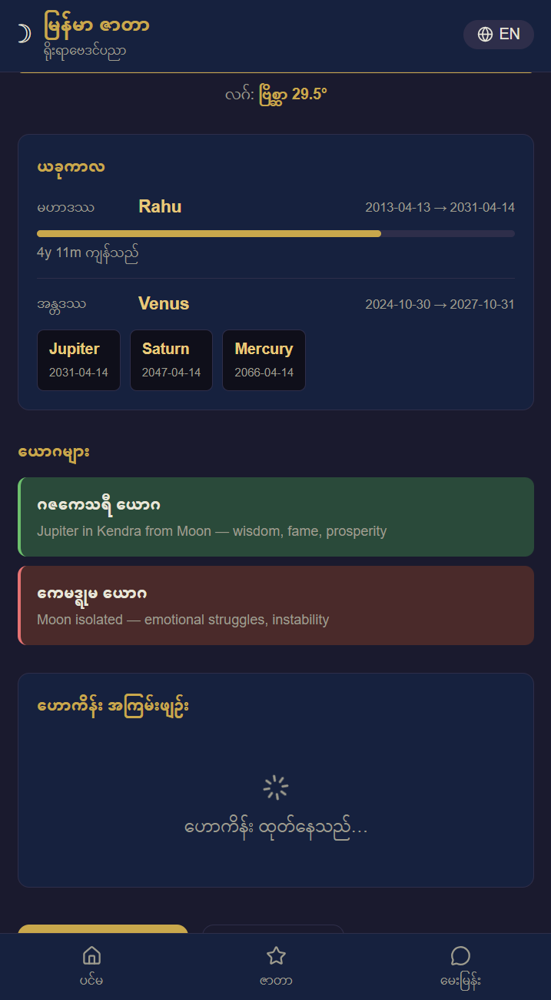

# မြန်မာ ဇာတာ — Myanmar Zata App

> **Myanmar Traditional Horoscope Calculator** — Bilingual (မြန်မာ / English)  
> Sidereal Vedic Jyotish adapted for Myanmar traditional astrology (ဇာတာ)

🔗 **Live Demo:** [https://pyi-soe-ltd.github.io/Myanmar-Zata/](https://pyi-soe-ltd.github.io/Myanmar-Zata/)

---

## ✨ Features

| Feature | Description |
|---|---|
| 🗺️ **Birth Data Input** | Date, time, location with auto-geocoding |
| 🪐 **Zata Chart** | South Indian style 12-Bhava chart with 9 planets |
| ⏳ **Dasha Timeline** | Vimshottari Dasha planetary period visualization |
| 🤖 **AI Reading** | Azure AI-powered bilingual horoscope interpretation |
| 💬 **Chat Interface** | Ask questions about your chart interactively |
| 📊 **Yoga Highlights** | Key planetary combinations and their effects |
| 🌐 **Bilingual UI** | Full Myanmar (Unicode) + English interface |
| 📱 **PWA Ready** | Installable as a mobile/desktop app |

---

## 📸 Screenshots

<p align="center">
  
  
</p>
<p align="center">
  
  
</p>
<p align="center">
  
</p>

---

## 🛠️ Tech Stack

- **React 19** + **Vite 8**
- **React Router v7** — client-side navigation
- **Luxon** — date/time & timezone handling (UTC+6:30)
- **Azure AI Foundry** — GPT-powered astrological readings
- **Lucide React** — icons
- **PWA** — offline-capable via service worker

---

## 🚀 Local Development

```bash
# Clone the repo
git clone https://github.com/PYI-SOE-LTD/Myanmar-Zata.git
cd Myanmar-Zata

# Install dependencies
npm install --legacy-peer-deps

# Copy env template and fill in your Azure AI keys
cp .env.example .env

# Start dev server
npm run dev
```

### Environment Variables

```env
VITE_AZURE_FOUNDRY_ENDPOINT=https://your-resource.openai.azure.com
VITE_AZURE_FOUNDRY_API_KEY=your-api-key-here
VITE_AZURE_FOUNDRY_MODEL=gpt-4o
```

---

## 📁 Project Structure

```
src/
├── pages/          # HomePage, InputPage, ChartPage, ChatPage
├── components/     # ZataChart, DashaTimeline, AIReading, BirthDataForm, ...
├── services/       # zataCalculator.js, azureAI.js, geocoder.js, i18n.js
└── context/        # ZataContext (global state)
```

---

## 📚 Read More — Myanmar Zata Knowledge Base

These reference documents explain the astrological system behind this app:

| Document | Description |
|---|---|
| [Myanmar Zata Calculation Guide](docs/Myanmar-Zata-Calculation-Guide.md) | Step-by-step ဇာတာ calculation — Lagna, planets, houses |
| [Myanmar Zata Horoscope Reference](docs/Myanmar-Zata-Horoscope-Reference.md) | Full reference — 12 Bhava, 9 Planets, aspects, reading methodology |

> **Key concepts:** ဇာတာ (Zata) requires exact birth time + location. Without exact birth time, use Mahabote (မဟာဘုတ်) instead. The app uses Sidereal (Nakshatra-based) zodiac, not Western Tropical.

---

## 📄 License

© PYI SOE LTD. All rights reserved.
